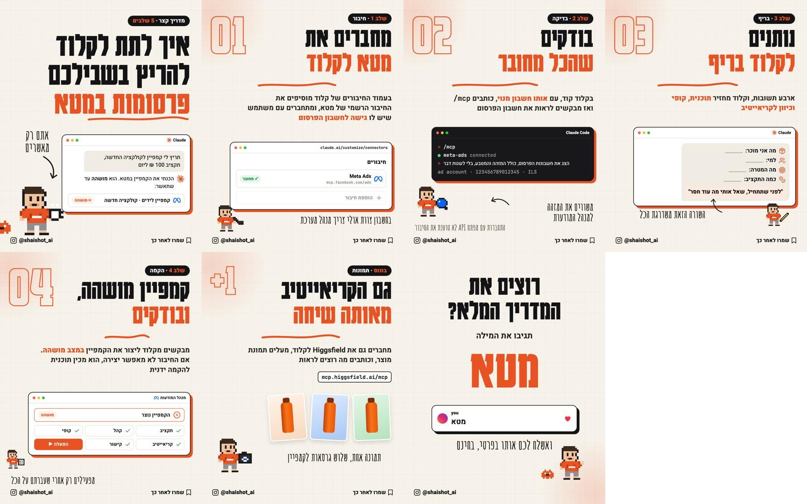

# סקיל: קרוסלות אינסטגרם בעברית (hebrew-ig-carousel)

סקיל ל-Claude שבונה קרוסלות אינסטגרם בעברית, מוכנות להעלאה. העיצוב קבוע ונקי, והעברית יוצאת מדויקת, כי השקפים
נבנים כדף אינטרנט ומצולמים, ולא נוצרים בבינה מלאכותית. בלי קרדיטים ובלי מנוי לכלי עיצוב.

נוצר על ידי @shaishot_ai



## מה צריך
- **Claude Code** (מומלץ), כי הסקיל מריץ סקריפט שמייצר את התמונות
- **Google Chrome** מותקן במחשב
- **Python 3** עם Pillow (אם חסר: `pip install pillow`)
- חיבור לאינטרנט (לפונטים ולאייקונים)

## הורדה
**[להורדת הסקיל (zip)](https://github.com/Shaus12/hebrew-ig-carousel/releases/latest/download/hebrew-ig-carousel.zip)**

## התקנה ב-Claude Code
1. מורידים ופותחים את קובץ ה-zip
2. מעבירים את התיקייה `hebrew-ig-carousel` לתיקיית הסקילים:
   - Mac / Linux: `~/.claude/skills/`
   - Windows: `%USERPROFILE%\.claude\skills\`
3. פותחים את Claude Code מחדש

## איך משתמשים
כותבים ל-Claude:

```
/hebrew-ig-carousel קרוסלה על איך לחבר את ג'ימייל לקלוד, 5 שלבים
```

בפעם הראשונה הוא ישאל מה ה-handle שלכם באינסטגרם ומה מילת התגובה. אחר כך הוא:
1. מציע תוכנית לשקפים
2. בונה את הקרוסלה
3. מרנדר את התמונות (1080x1350) ובודק שאין חפיפות
4. כותב כיתוב לפוסט עם האשטגים

התמונות נשמרות בתיקייה `carousels/` בפרויקט שלכם.

## מה יש בפנים
- `SKILL.md`: ההוראות ל-Claude
- `reference/style.md`: מערכת העיצוב
- `templates/base.html`: שלד לקרוסלה חדשה
- `templates/example-meta-ads.html`: קרוסלה גמורה לדוגמה
- `scripts/render.py`: מייצר את קבצי ה-PNG
- `assets/icons/`: לוגואים (Claude, Meta, Instagram)

## שינוי צבע
הצבע הכתום מוגדר בשתי שורות בתחילת `templates/base.html`: `--or` ב-CSS ו-`const OR` בסקריפט.
